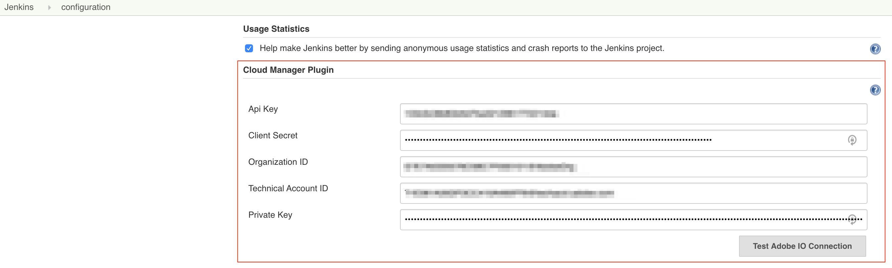
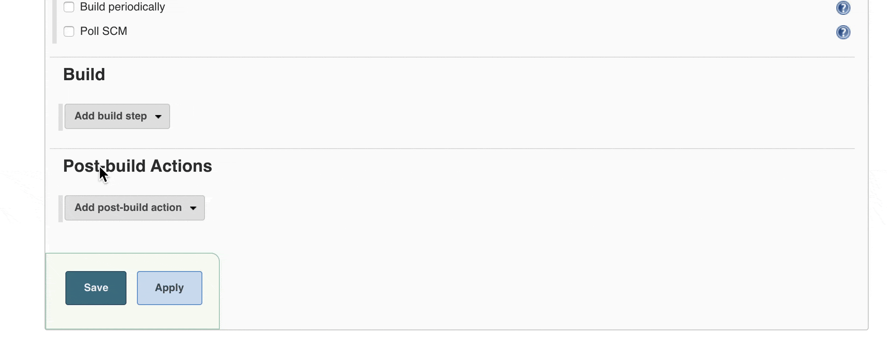

# Adobe Cloud Manager Jenkins Plugin

This plugin integrates with [Adobe Cloud Manager API](https://www.adobe.io/apis/experiencecloud/cloud-manager/docs.html) to allow a Jenkins job to start a specific pipeline.

## Installation

### Manual

1. Download latest version `.hpi` file from this repos releases section
2. Manually install that into Jenkins. [See Advanced Installtion Docs](https://www.jenkins.io/doc/book/managing/plugins#advanced-installation)

### As an official Jenkins plugin

Coming as soon as I figure out how to publish it.

## Usage

### Create AdobeIO Service
You must create a **Cloud Manager Service Integration** in your Adobe IO console. [Follow adobe's documentation](https://www.adobe.io/apis/experiencecloud/cloud-manager/docs.html#!AdobeDocs/cloudmanager-api-docs/master/create-api-integration.md)

### Configure Plugin with service credentials

After installing the plugin: In your Jenkins instance, 

1. navigate to `Manage Jenkins` > `Configure System` 
2. Scroll down to `Cloud Manager Plugin`
3. Fill in the fields from your created Adobe IO Service Integration (see screenshot below)
4. Click `Test Adobe IO Connection`
5. A success message will display, save the configuration.

   
  
   

### Add Cloud Manager Build Step to a Job

1. Open any Jenkins job
2. Scroll to `Build` section
3. Click `Add Build Step`
4. Select `Cloud Manager Build Step`
5. Select the Program and Pipeline you want this job to start.

   
  
   

