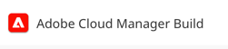

# Cloud Manager Build Action

When either the [Pipeline Start Builder](/doc/builder/start-pipeline/README.md) or the [Pipeline Start Trigger](/doc/trigger/start-pipeline/README.md) are used, the Cloud Manager pipeline execution details are stored on the Jenkins build. 

Future steps require this information to determine if they are interested in WebHook events, or use it to make API calls for state observation.

A link to the build information is available on the build side panel:

     
    
     

