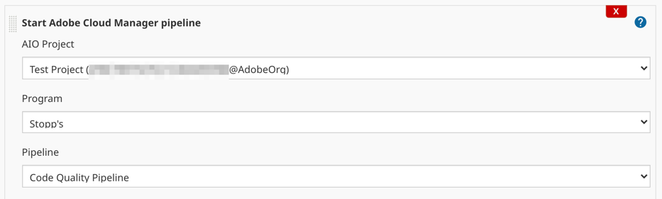

# Start Pipeline Builder

This builder will start the specified Adobe Cloud Manager pipeline. 

## Usage

This can be used as either a Builder via the UI or a Step in a Pipeline definition.

### Builder

Configure the build step as part of the job. Selecting the Adobe IO Configuration will populate the Programs available. Selection of a program will display the available pipelines.

<p align="center">
  <br/>
  
  <br/>
</p>

### Step

Syntax

``` 
acmStartPipeline(
    aioProject: 'AIO Project',
    program: 'Program Name',
    pipeline: 'Pipeline Name'
)
```

#### Properties

* `aioProject`: The name of the Adobe IO Project configuration as specified in the Jenkins Global settings
* `program`: A reference to the Program context for the Pipeline.
    * This value can be specified as a name or id of the Program
* `pipeline`: The pipeline in the program that will trigger this Jenkins pipeline.
    * This value can be specified as a name or id of the Program
