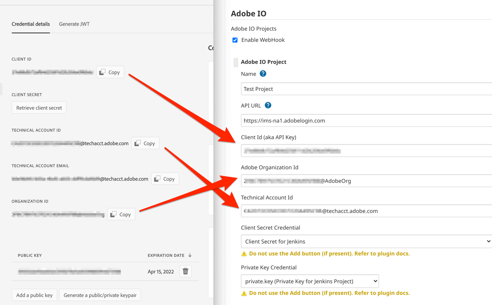
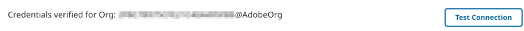

# Adobe IO Project

An Adobe IO Project configuration is required for build steps to authenticate to Adobe IO for API calls. 

## Configure Project

Configuring a project is done by copying the values from the AIO Console to Jenkins. The example below shows the use of the example Client Secret and Private Key for the configuration. As a Jenkins Admin, navigate to `Manage Jenkins` -> `Configure System` and scroll down to the section called `Adobe IO`, click on `Add Adobe IO Project` and enter the values accordingly

   
  
   

## Test Connection

Once the configuration is complete, you can test it with the **Test Connection** button.

   
  
   

## Configuration Details

### Enable Webhook

This is a global property, it toggles whether or not the WebHook will process AdobeIO Events. By default the WebHook is disabled. 

#### Event Validation

**All requests** received by the WebHook are validated according to the [AdobeIO Documentation](https://www.adobe.io/apis/experienceplatform/events/docs.html#!adobedocs/adobeio-events/master/intro/webhooks_intro.md#authenticating-events). Any event that cannot be validated returns an error; this includes the *Challenge* request.

This feature can not be disabled.

#### Enabled

When enabled, the WebHook to process requests and pass them on to known subscribers. The WebHook endpoint is based on the Jenkins URL, which is found on the Jenkins Global configuration page. The WebHook is registered at:

`{{Jenkins Url}}/aio-cloud-manager-webhook/`

#### Disabled

It is not possible to disable the Webhook Servlet entirely. However, when disabled the WebHook will ignore all requests, logging a warning that a request was received.

## Multiple Configurations

This plugin supports multiple Adobe IO project configurations. Each must have a unique name, and are referenced by this name in step configurations. Simply add a new configuration for each integration needed. 

### WebHook Handling

The WebHook will use all available configurations to determine if a received event is valid. The first configuration found that can validate an event will be used as the AIO Project reference for all subscribers.

Therefore, two configurations with the same credential details but different names can cause event processing to be lost.
