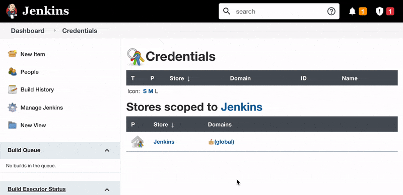
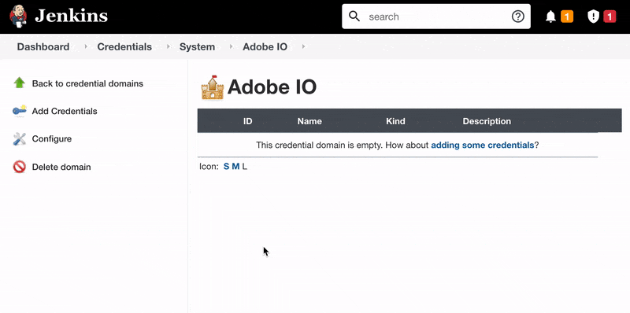

# Jenkins Credentials

This plugin requires that credentials (private key and client secret) be added under a special Jenkins Credentials Domain that is restricted to the host `ims-na1.adobelogin.com`

## Create the Domain

1. As a Jenkins Admin, navigate to `Manage Jenkins` -> `Manage Credentials` and you should see the default `Jenkins` store listed.
1. Click the triangle icon next to the `Jenkins` store and click `Add Domain`. (This is tricky, see below screen recording.)
1. Use any Domain Name. We went with `Adobe IO`
1. Under `Specifications` section, click `Add` button and choose `hostname`
1. In the `Include` field, paste the domain `ims-na1.adobelogin.com`
1. Click `OK` to save.

   
  
   

## Add the Adobe IO Client Secret

1. Navigate to the domain we created in the steps above.
1. Click `Add Credentials`
1. From the `Kind` dropdown, select `Secret text`
1. Keep the scope as `Global`
1. Add the Client Secret from the Adobe IO Project
1. Give it any ID you like, but it should be something meaningful and representative of the Adobe IO project. (We went with `cm-client-secret`)

   
  
   

## Add the Adobe IO Private Key

1. Navigate to the domain we created in the steps above.
1. Click `Add Credentials`
1. From the `Kind` dropdown, select `Secret file`
1. Keep the scope as `Global`
1. Upload the private key file.
1. Give it any ID you like,  but it should be something meaningful and representative of the Adobe IO project. (We went with `cm-private-key`)

   
  
   

