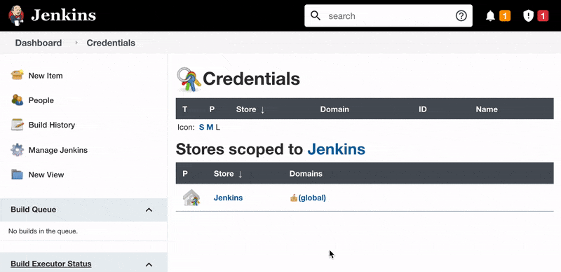
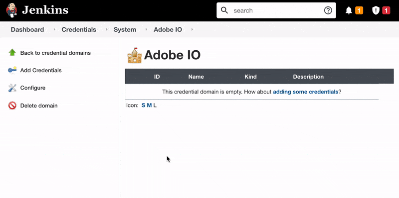

# Jenkins Credentials

This plugin requires that credentials, private key and client secret, be added under a special Jenkins Credentials Domain that is restricted to the host `ims-na1.adobelogin.com`

## Creating the Domain

1. As a Jenkins Admin, navigate to `Manage Jenkins` -> `Manage Credentials` and you should see the default `Jenkins` store listed.
2. Click the triangle icon next to the `Jenkins` store and click `Add Domain`. This is tricky; see below screen recording.
3. Use any Domain Name. We went with `Adobe IO`
4. Under `Specifications` section, click `Add` button and choose `hostname`
5. In the `Include` field, paste the domain `ims-na1.adobelogin.com`
6. Click `OK` to save.

   
  
   

## Adding the Adobe IO Client Secret to the Domain created abobe

1. Make sure you have navigated to the domain we created in the steps above.
2. Click `Add Credentials`
4. From the `Kind` dropdown, select `Secret text`
5. Keep the scope as `Global`
6. Add the Client Secret from the Adobe IO Project
7. Give it any ID you like. We went with `cm-client-secret`

   
  
   

## Adding the Adobe IO Private Key

1. Make sure you have navigated to the domain we created in the steps above.
2. Click `Add Credentials`
4. From the `Kind` dropdown, select `Secret file`
5. Keep the scope as `Global`
6. Upload the private key file.
7. Give it any ID you like. We went with `cm-private-key`

   
  
   

